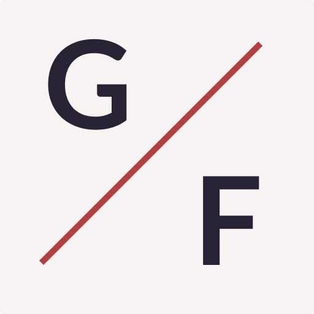

<p align="center">
  
</p>
<h1 align="center">
  Github Fight
</h1>

<!-- Badges -->
<p align="center">
  <a href="https://github.com/codigofalado/github-fight/graphs/commit-activity" alt="Maintenance">
    
  </a>

  <!-- if your app is a website -->
  <a href="https://githubfight.netlify.app/" alt="Website githubfight.netlify.app">
    
  </a>

  <!-- License -->
  <a href="./LICENSE" alt="License: MIT">
    
  </a>

  <!-- codefactor -->
  <!-- <a href="https://www.codefactor.io/repository/github/codigofalado/github-fight" alt="CodeFactor">
    
  </a> -->

  <!-- if your app is a website deployed on Netlify -->
  <a href="https://app.netlify.com/sites/githubfight/deploys" alt="Netlify Status">
    
  </a>

  <br/>

  

  <!-- version -->
  

  <!-- GitHub repo size -->
  

  <!-- Social -->
  <a href="https://github.com/codigofalado/github-fight/stargazers">
    
  </a>
</p>

<!-- summary -->
<p align="center">
  <a href="#clipboard-description">Description</a>&nbsp;&nbsp;&nbsp;|&nbsp;&nbsp;&nbsp;
  <a href="#rocket-getting-started">Getting Started</a>&nbsp;&nbsp;&nbsp;|&nbsp;&nbsp;&nbsp;
  <a href="#-whats-inside">What's inside?</a>&nbsp;&nbsp;&nbsp;|&nbsp;&nbsp;&nbsp;
  <a href="#memo-license">License</a>
</p>

> under construction...

## :clipboard: Description
A simple way to compare Github Reactions. 😃

## :rocket: Getting Started

1. **Download the repository**

  - Using Git
```shell
  git clone https://github.com/codigofalado/github-fight.git
```
  - Using Github CLI
```shell
  gh repo clone codigofalado/github-fight
```
  > :bulb: or whichever way you prefer

2. **Installation**

Inside the repo folder, run `yarn` or `npm install` command to install the dependencies.

3. **Execution**

run `yarn start` or `npm start` command to start a local server and get a test! :rocket:

> :bulb: If you use another package manager, run the reference commands for install the dependencies and execute the start script on package.json


## 🧐 What's inside?

### :building_construction: Technologies
- [Gatsby](https://www.gatsbyjs.org/)
- [ReactJS](https://reactjs.org/)

### :lipstick: Linter tools
- [Eslint](https://eslint.org/)
- [Prettier](https://prettier.io/)
- [EditorConfig](https://editorconfig.org/)

### :package: Packages
- [Apollo](https://www.apollographql.com/docs/react/)
- [React Helmet](https://github.com/nfl/react-helmet)
- [React Icons](https://react-icons.netlify.com/#/)
- [Styled Compoments](https://www.styled-components.com/)
- [Polished](https://polished.js.org/)
- [Typeface lato](https://www.npmjs.com/package/typeface-lato)


### :card_file_box: Gatsby plugins
- [Manifest](https://www.gatsbyjs.org/packages/gatsby-plugin-manifest/)
- [Netlify](https://www.gatsbyjs.org/packages/gatsby-plugin-netlify/)
- [Netlify cache](https://www.gatsbyjs.org/packages/gatsby-plugin-netlify-cache/)
- [Offline](https://www.gatsbyjs.org/packages/gatsby-plugin-offline/)
- [Page Creator](https://www.gatsbyjs.org/packages/gatsby-plugin-page-creator/)
- [Polished](https://www.gatsbyjs.org/packages/gatsby-plugin-polished/)
- [Preload Fonts](https://www.gatsbyjs.org/packages/gatsby-plugin-preload-fonts/)
- [React Helmet](https://www.gatsbyjs.org/packages/gatsby-plugin-react-helmet/)
- [Sharp](https://www.gatsbyjs.org/packages/gatsby-plugin-sharp/)
- [Styled Components](https://www.gatsbyjs.org/packages/gatsby-plugin-styled-components/)

### A quick look at the top-level directories inside the `./src`.

    ./src
     ├── @types
     ├── assets
     ├── components
     ├── hooks
     ├── Layout
     ├── pages
     ├── styles

1.  **`assets`**: all resources used. How icons, images, etc.

2.  **`pages`**: each folder is a website page.

3.  **`styles`**: global styles.

## :memo: License

This project is under the MIT license. See the file [LICENSE](LICENSE) for more details.

---

Build with 💙 By [Henrique Miranda](http://thehenry.dev/).

Based on the [readme template](https://gist.github.com/henry-ns/a00234378353d9ca43e1bfe043202192).
